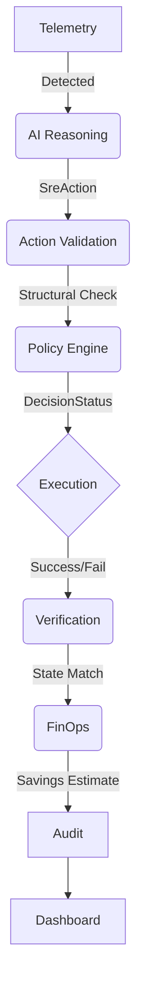
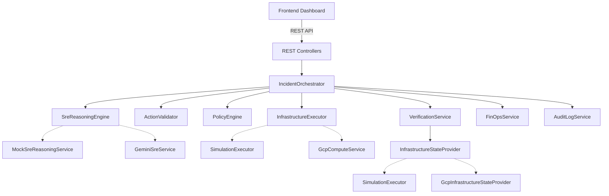
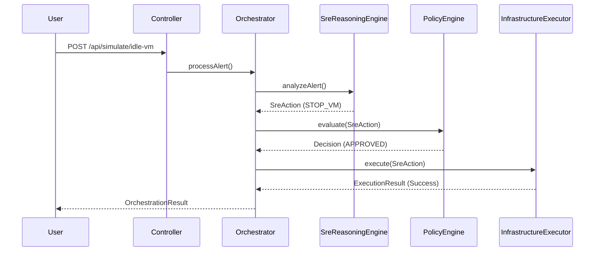
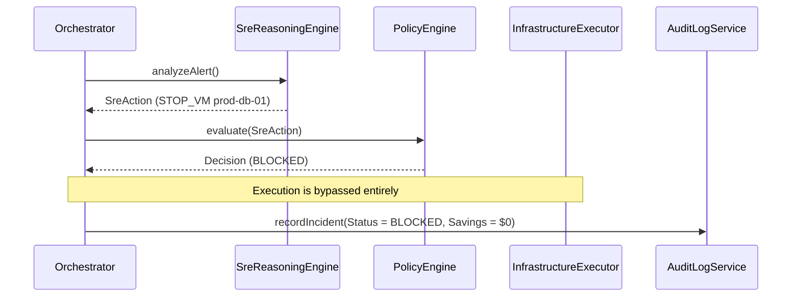
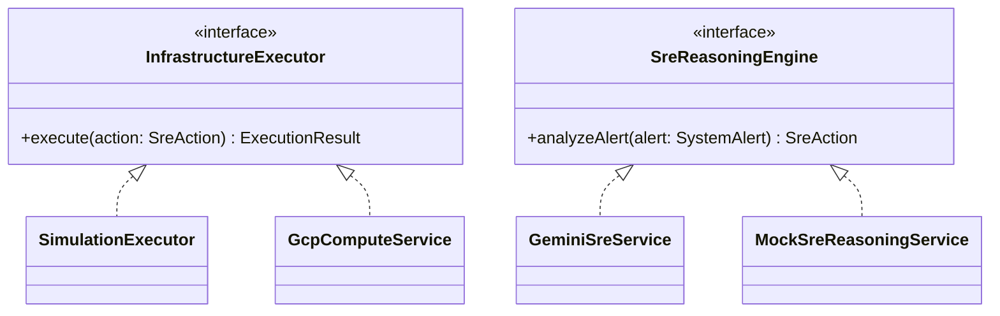

# Autonomous SRE + FinOps Agent

An AI-assisted autonomous SRE and FinOps platform that detects infrastructure incidents, reasons about remediation, enforces deterministic safety policies, executes approved actions, verifies outcomes, estimates financial impact, and records an audit trail.

---

## 2. Project Overview

Modern cloud infrastructure demands rapid incident response and continuous cost optimization. However, giving AI direct, unrestricted control over production environments is dangerous. Manual remediation increases Mean Time To Recovery (MTTR), but unverified automation can cause catastrophic outages or silent failures.

This project solves this by combining **SRE reliability automation** with **FinOps cost optimization**, wrapped in **deterministic safety controls**. 

The central principle of this platform is:
1. **AI proposes.**
2. **Policy authorizes.**
3. **Executor acts.**
4. **Verification confirms.**
5. **FinOps measures.**
6. **Audit records.**

This ensures that intelligent remediation is securely sandboxed, fully auditable, and accountable to strict business and safety rules.

---

## 3. Problem Statement

- **Slow Incident Response:** Manual infrastructure remediation drastically increases MTTR.
- **Missed Cost Savings:** Idle resources are often ignored because teams are focused on reliability, missing FinOps optimization opportunities.
- **Dangerous Automation:** Unrestricted AI or scripts making infrastructure mutations can cause outages. AI recommendations alone should *never* authorize production changes.
- **Blind Execution:** Remediation should be structurally verified rather than blindly assumed successful.
- **Unmeasured Impact:** The financial impact of infrastructure actions (scaling, terminating) should be measured consistently.

---

## 4. Solution

The platform provides a complete end-to-end pipeline:



- **Telemetry:** Ingests simulated system alerts (CPU, Memory, Request Rate).
- **AI Reasoning:** Uses Google Gemini (or a deterministic mock) to propose a structured `SreAction`.
- **Action Validation:** Validates the payload for missing targets or malformed data.
- **Policy Engine:** Enforces deterministic business rules (e.g., blocking DB shutdowns).
- **Execution:** Safely runs the action via an executor (Simulation or optional GCP adapter).
- **Verification:** Double-checks the resulting infrastructure state against the expected state.
- **FinOps:** Calculates the estimated monthly savings (if any) based on the successful action.
- **Audit:** Records the entire lifecycle into an immutable (in-memory) history.
- **Dashboard:** A React UI visualizing the real-time orchestration state and history.

---

## 5. Key Design Principles

### Safety First
AI cannot directly mutate infrastructure. It can only propose actions.

### Policy Separation
AI recommendation and authorization are strictly separated concerns. The AI's confidence score does not bypass deterministic policies.

### Provider Independence
Core orchestration does not depend on Google Cloud SDK types or any specific provider. It operates on provider-neutral domain models.

### Verification
Successful execution is not assumed. The system verifies the expected state post-mutation.

### FinOps Integrity
AI-proposed savings are not automatically counted as realized/accepted savings. If an action fails or is blocked, the savings are `$0`.

### Simulation First
The default runtime does not require GCP credentials or billing. It uses an in-memory simulation executor.

### Auditability
Each incident produces a comprehensive lifecycle record encompassing the alert, decision, execution, verification, and financial impact.

---

## 6. System Capabilities

| Capability | Description | Status |
|---|---|---|
| Incident Detection | Ingests simulated telemetry alerts (CPU, Memory, etc.) | IMPLEMENTED |
| Gemini Reasoning | AI analysis via Google Gemini API | IMPLEMENTED (Requires API Key) |
| Deterministic Mock Reasoning | Fast, deterministic reasoning for tests and default flows | IMPLEMENTED |
| Action Validation | Structural integrity checks on AI output | IMPLEMENTED |
| Policy Enforcement | Strict business rule evaluation | IMPLEMENTED |
| Approval Semantics | Actions can be flagged for human review | IMPLEMENTED |
| Simulated Execution | Safe, in-memory infrastructure mutation | IMPLEMENTED (Default) |
| Verification | Post-action state verification | IMPLEMENTED |
| FinOps Estimation | Financial savings calculation for cost-optimization | IMPLEMENTED |
| Audit History | In-memory incident lifecycle recording | IMPLEMENTED |
| REST APIs | Full Spring Boot API layer | IMPLEMENTED |
| React Dashboard | Real-time monitoring and control UI | IMPLEMENTED |
| Google Cloud Adapter | Real GCP compute mutation capabilities | OPTIONAL (Disabled by default) |

---

## 7. High-Level Architecture (HLD)



---

## 8. Data Flow

An incident follows a strict path:
1. `SystemAlert` triggers the `IncidentOrchestrator`.
2. The `SreReasoningEngine` outputs an `SreAction`.
3. `ActionValidator` verifies structural safety.
4. `PolicyEngine` evaluates the action, returning a `PolicyDecision` containing a `DecisionStatus` (`APPROVED`, `BLOCKED`, `REQUIRES_APPROVAL`).
5. If `APPROVED`, the `InfrastructureExecutor` runs the action and returns an `ExecutionResult`.
6. `VerificationService` confirms the result matches reality, yielding a `VerificationResult`.
7. `FinOpsService` calculates the `FinOpsResult`.
8. `AuditLogService` persists the final `IncidentAuditLog`.
9. The `OrchestrationResult` is returned to the frontend dashboard.

---

## 9. Safety Architecture

The safety layer explicitly prevents dangerous AI hallucinations.
- `ActionValidator`: Checks for null targets or missing fields.
- `PolicyEngine`: Applies deterministic `SafetyPolicy` rules.

**Decision Statuses:**
- `APPROVED`: The action passes all checks and may execute.
- `BLOCKED`: The action violates a safety rule. Execution is completely bypassed.
- `REQUIRES_APPROVAL`: The action is safe but sensitive, requiring human intervention (execution is bypassed in this automated flow).

**Policy Precedence Example:**
If the AI proposes a `STOP_VM` action on `prod-db-01` to save money:
1. AI proposes it with high confidence.
2. `PolicyEngine` detects the `prod-db` target and evaluates the protection rule.
3. The decision becomes `BLOCKED`.
4. The `InfrastructureExecutor` is **never called**.
5. Verification is skipped.
6. FinOps savings are recorded as **`$0`**.
7. The Audit Log records the incident as `BLOCKED`.

---

## 10. AI / Gemini Architecture

The system abstracts AI reasoning behind the `SreReasoningEngine` interface.
This adheres to the Dependency Inversion Principle; the orchestrator does not depend directly on Gemini.

Implementations:
- `MockSreReasoningService`: Deterministic mock used by default.
- `GeminiSreService`: Integrates with Google Gemini via Spring AI when the `gemini` profile is active.

The frontend never calls Gemini directly. All API keys and reasoning logic are safely contained within the Spring Boot backend environment.

---

## 11. Structured AI Output

The AI is instructed to return a strictly structured payload mapping to the `SreAction` domain model:

- `action`: The enum action type (`SCALE_UP`, `STOP_VM`, `RESTART_VM`, etc.)
- `target`: The instance name to mutate.
- `reason`: Explanation for the action.
- `rootCause`: Detected root cause of the alert.
- `confidence`: AI confidence score (0.0 to 1.0).
- `severity`: Alert severity (`LOW`, `MEDIUM`, `HIGH`, `CRITICAL`).
- `estimatedSavings`: AI's projection of savings.
- `requiresApproval`: Boolean flag for sensitive actions.

This structured output guarantees that the policy engine can deterministically evaluate the AI's intent.

---

## 12. Orchestration

The `IncidentOrchestrator` manages the lifecycle of an incident across several states (`IncidentStatus`):

`DETECTED` → `ANALYZING` → `ACTION_PROPOSED` → `POLICY_CHECK` → `EXECUTING` → `VERIFYING` → `RESOLVED`

**Early Exits:**
- If the policy engine returns `BLOCKED` or `REQUIRES_APPROVAL`, the status becomes `BLOCKED` or `APPROVAL_REQUIRED`, and the flow exits before execution.
- If execution returns `success = false` (e.g., GCP mutation disabled), the status becomes `FAILED`, bypassing verification and realizing `$0` savings.

---

## 13. Execution Architecture

The system abstracts infrastructure mutation behind the `InfrastructureExecutor` interface, keeping orchestration provider-neutral.

Implementations:
- `SimulationExecutor`: In-memory state mutation (default).
- `GcpComputeService`: Actual Google Cloud API mutations (optional, disabled by default).

---

## 14. Simulation Mode

Simulation is the default runtime mode. It utilizes `SimulationExecutor` and `TelemetrySimulator` to provide a fully functional environment without requiring real cloud infrastructure or billing.
- Infrastructure state is held in memory (`SimulatedVm`).
- It executes deterministic scenarios (`CPU Spike`, `Idle VM`, etc.).
- It is perfectly safe for local development, testing, and hackathon demos.

---

## 15. Simulation Scenarios

| Scenario | Telemetry (Simulated) | Expected Action | Policy | Execution | Verification | FinOps Impact |
|---|---|---|---|---|---|---|
| **CPU Spike** | 97% CPU, High Requests on `prod-web-01` | `SCALE_UP` | `APPROVED` | `EXECUTED` | Capacity increased | `$0` direct savings |
| **Idle VM** | 5% CPU, 0 Requests on `dev-batch-01` | `STOP_VM` | `APPROVED` | `EXECUTED` | VM is `STOPPED` | `$150` simulated estimate |
| **Traffic Surge** | High CPU, 3000 Requests on `prod-web-03` | `SCALE_UP` | `APPROVED` | `EXECUTED` | Capacity increased | `$0` direct savings |
| **Memory Leak** | 95% Memory on `prod-api-02` | `RESTART_VM` | `APPROVED` | `EXECUTED` | VM is `RUNNING` | `$0` direct savings |
| **Unsafe Action** | 5% CPU, 0 Requests on `prod-db-01` | `STOP_VM` | `BLOCKED` | **NOT EXECUTED** | Skipped (N/A) | **`$0`** |

---

## 16. Verification Architecture

The `VerificationService` checks the outcome of an execution. It relies on the `InfrastructureStateProvider` interface to fetch the current `VmState`.
- `SCALE_UP`: Verifies capacity increased.
- `STOP_VM`: Verifies state is `STOPPED`.
- `RESTART_VM`: Verifies state is `RUNNING`.

This separation guarantees that a fake "success" from an executor is caught if the actual infrastructure did not mutate.

---

## 17. FinOps Architecture

The `FinOpsService` computes cost impact. 
It strictly separates the **AI proposed estimatedSavings** from the **accepted/recorded savings**.

- If an action is `BLOCKED`, `REQUIRES_APPROVAL`, or `FAILED`, the recorded savings are strictly **`$0`**.
- Reliability actions (`SCALE_UP`, `RESTART_VM`) yield **`$0`** direct savings.
- A successful optimization (e.g., stopping an idle VM) yields a positive simulated estimate (e.g., `$150`).

*Explicit Disclaimer: These are simulated estimates for demonstration, not actual cloud billing data.*

---

## 18. Audit Architecture

The `AuditLogService` records the entire lifecycle into an `IncidentAuditLog`. 
- Storage is currently in-memory (ConcurrentHashMap).
- It records the initial alert, AI action, policy decision, final status, execution result, verification result, and realized FinOps savings.
- *Limitation: Restarting the backend application clears this in-memory history.*

---

## 19. Google Cloud Adapter — Phase 5B

An optional Google Cloud Compute Engine integration exists.
The core orchestration delegates to:
- `GcpComputeService` (implements `InfrastructureExecutor`)
- `GcpInfrastructureStateProvider` (implements `InfrastructureStateProvider`)

These classes rely on a `GcpClient` abstraction (`DefaultGcpClient`) which interacts directly with the Google Compute Engine API. The adapter safely maps GCP specific strings and machine types (e.g., extracting vCPU capacity from `n1-standard-4`) into the system's provider-neutral models.

---

## 20. GCP Safety Model

**Real GCP mutation is disabled by default.**

If the `gcp` profile is activated, the application will default to:
`finops.gcp.mutations.enabled=false`

When disabled:
- The SDK mutation call (e.g., `startInstance`) is completely bypassed.
- `GcpComputeService` returns an `ExecutionResult` with `success = false`.
- The incident orchestrator instantly transitions to `FAILED`.
- Verification is skipped, avoiding false-positive success claims.
- FinOps savings remain strictly **`$0`**.
- The audit log accurately reflects the failure/disabled state.

*No real GCP resources were created or mutated during the standard development and testing of this repository.*

---

## 21. GCP Authentication

The GCP adapter uses Google Application Default Credentials (ADC).
No credentials are hard-coded in the repository.
To use the GCP mode, the host environment must be authenticated (e.g., via `gcloud auth application-default login`).
**GCP credentials are NOT required for the default simulation mode.**

---

## 22. GCP Configuration

Optional properties (used only when the `gcp` profile is active):
- `GCP_PROJECT_ID` (Required for GCP mode)
- `GCP_COMPUTE_ZONE` (Required for GCP mode)
- `GCP_MUTATIONS_ENABLED` (Defaults to `false`. Must be explicitly set to `true` to allow actual cloud changes).

---

## 23. Spring Profiles

- **Default (No profile):** Activates `SimulationExecutor`, `MockSreReasoningService`.
- **`gemini`:** Activates `GeminiSreService` (Requires `GEMINI_API_KEY`).
- **`gcp`:** Activates `GcpComputeService` and `GcpInfrastructureStateProvider`.

Simulation remains the default to ensure a seamless, zero-config onboarding and testing experience.

---

## 24. Frontend Architecture

The frontend is a React application built with Vite and standard JavaScript/CSS.
The architecture consists of:
- **Dashboard:** The main orchestration view.
- **REST API Integration:** Uses native `fetch` (via `api.js`) to communicate with the Spring Boot backend.
- **Hooks:** React hooks manage state and polling.

---

## 25. Frontend Component Architecture

- `Header`: Application branding and status indicators.
- `SystemHealthOverview`: Aggregated health metrics.
- `SimulationControls`: Buttons triggering the backend REST scenario endpoints.
- `ClusterMetrics`: Real-time view of current VM states and utilization.
- `AgentDecisionCard`: Displays the AI's proposed action and reasoning.
- `PolicyGuardrailPanel`: Visualizes the policy engine's structural authorization.
- `BeforeAfterMetrics`: Highlights verification results.
- `FinOpsSavingsCard`: Displays realized vs estimated savings.
- `IncidentTimeline`: Chronological view of the current incident's progression.
- `AgentLogTerminal`: Historical list of all processed incidents.

---

## 26. Frontend Data Flow

1. React triggers an action via `api.js`.
2. The REST API processes the request and returns an `OrchestrationResult` or `IncidentAuditLog`.
3. The Dashboard normalizes the payload. (Because `OrchestrationResult` represents an active incident while `IncidentAuditLog` represents historical data, they have slightly different structures. Normalization ensures the UI components can seamlessly render both).
4. State is propagated down to the UI components.

---

## 27. API Reference

| Method | Endpoint | Purpose | Request | Response |
|---|---|---|---|---|
| `GET` | `/api/health` | Health check | None | `{"status":"healthy"}` |
| `GET` | `/api/incidents` | Fetch all audit logs | None | `List<IncidentAuditLog>` |
| `GET` | `/api/simulation/vms` | Fetch current VM states | None | `List<VmState>` |
| `POST` | `/api/simulate/cpu-spike` | CPU Spike scenario | None | `OrchestrationResult` |
| `POST` | `/api/simulate/memory-leak` | Memory Leak scenario | None | `OrchestrationResult` |
| `POST` | `/api/simulate/traffic-surge`| Traffic Surge scenario | None | `OrchestrationResult` |
| `POST` | `/api/simulate/idle-vm` | Idle VM scenario | None | `OrchestrationResult` |
| `POST` | `/api/simulate/unsafe-action`| Unsafe DB Action | None | `OrchestrationResult` |
| `POST` | `/api/alerts` | Inject a raw `SystemAlert` | `SystemAlert` | `OrchestrationResult` |

---

## 28. Project Structure

```text
finops-agent/
├── backend/
│   ├── pom.xml
│   └── src/
│       ├── main/
│       │   ├── java/com/sreagent/finops/
│       │   │   ├── config/
│       │   │   ├── controller/
│       │   │   ├── execution/
│       │   │   ├── model/
│       │   │   ├── safety/
│       │   │   ├── service/
│       │   │   └── simulation/
│       │   └── resources/
│       │       └── application.properties
│       └── test/
│
└── frontend/
    ├── package.json
    ├── vite.config.js
    └── src/
        ├── api/
        ├── components/
        └── main.jsx
```

---

## 29. Technology Stack

| Layer | Technology | Purpose |
|---|---|---|
| Backend Framework | Java 21, Spring Boot 3.3.4 | Core server |
| AI Integration | Spring AI | Gemini abstraction |
| AI Model | Google Gemini (`gemini-3.7-flash`) | SRE Reasoning |
| Cloud SDK | Google Cloud Compute SDK | Optional GCP adapter |
| Build Tool | Maven | Backend compilation & testing |
| Frontend Framework| React 19, Vite | Dashboard UI |
| Styling | CSS | Component styling |

---

## 30. Prerequisites

- **Java 21+**
- **Maven** (or use included `mvnw.cmd` / `./mvnw`)
- **Node.js 18+**
- **npm**

---

## 31. Environment Variables

**Required for default Simulation mode:**
None.

**Optional Gemini AI Integration:**
`$env:GEMINI_API_KEY="YOUR_KEY_HERE"`

**Optional Google Cloud Adapter:**
`$env:GCP_PROJECT_ID="your-project"`
`$env:GCP_COMPUTE_ZONE="your-zone"`
`$env:GCP_MUTATIONS_ENABLED="true"` (Default is false)

---

## 32. How to Run the Backend

Open a PowerShell terminal:
```powershell
cd backend
.\mvnw.cmd clean compile
.\mvnw.cmd test
.\mvnw.cmd spring-boot:run
```
The backend will start an embedded Tomcat server on port `8080`. Ensure no other applications are using this port.

---

## 33. How to Run the Frontend

Open a new PowerShell terminal:
```powershell
cd frontend
npm install
npm run dev
```
Vite will start the development server on `http://localhost:5173`.

---

## 34. Full Application Startup

To perform a clean start:
1. Open Terminal 1, navigate to `backend/`, and run `.\mvnw.cmd spring-boot:run`.
2. Open Terminal 2, navigate to `frontend/`, and run `npm run dev`.
3. Open your browser to `http://localhost:5173`.
4. Verify backend connectivity by ensuring "API CONNECTED" is green in the UI.

---

## 35. Health Check

```powershell
Invoke-RestMethod -Uri http://localhost:8080/api/health
```

---

## 36. API Smoke Tests

You can trigger scenarios directly via PowerShell:
```powershell
Invoke-RestMethod -Method Post -Uri http://localhost:8080/api/simulate/cpu-spike
Invoke-RestMethod -Method Post -Uri http://localhost:8080/api/simulate/idle-vm
Invoke-RestMethod -Method Post -Uri http://localhost:8080/api/simulation/vms
Invoke-RestMethod -Uri http://localhost:8080/api/incidents
```

---

## 37. Demo Walkthrough (3-Minute Script)

1. **Open Dashboard:** Navigate to `http://localhost:5173`. Point out the active VM metrics and zero incidents.
2. **Trigger CPU Spike:** Click the "CPU Spike" button. Explain how the AI reasons a `SCALE_UP` action, the Policy Engine approves it, execution succeeds, and verification passes. Point out that FinOps savings are `$0`.
3. **Trigger Idle VM:** Click "Idle VM". Show the AI proposing `STOP_VM`. Once executed and verified, highlight the FinOps card registering the `$150` simulated monthly savings.
4. **Trigger Unsafe Action:** Click "Unsafe DB Stop". Watch the AI propose stopping a database. Point to the Policy Guardrail panel immediately marking it **BLOCKED**. 
5. **Emphasize Safety:** Explicitly show that execution was bypassed, verification was skipped, and FinOps savings remained `$0`. 
6. **Show Incident History:** Scroll to the terminal log to prove the audit trail captured the blocked attempt securely.

*Key Message: AI proposes. Policy controls. Executor acts. Verification confirms. FinOps measures.*

---

## 38. Testing

- **Backend:** 85 Unit and Integration tests passing. Tests use mocks and `SimulationExecutor` ensuring no real cloud mutations occur.
- **Frontend:** ESLint passes with 0 errors/warnings. Production build (`npm run build`) compiles successfully.

---

## 39. Security

- The frontend never contains the `GEMINI_API_KEY` or GCP credentials.
- The `GEMINI_API_KEY` is securely injected via backend environment variables.
- GCP credentials rely exclusively on secure local ADC (Application Default Credentials); no service account JSON files are committed to the repository.
- GCP mutation is explicitly disabled by default (`GCP_MUTATIONS_ENABLED=false`).
- Deterministic policy guardrails sit firmly between the AI's output and the infrastructure executor.

---

## 40. Design / SOLID Principles

- **Single Responsibility Principle:** `SreReasoningEngine` only reasons. `PolicyEngine` only authorizes. `FinOpsService` only calculates cost.
- **Dependency Inversion Principle:** The `IncidentOrchestrator` does not depend on Gemini or GCP. It depends entirely on abstractions (`SreReasoningEngine`, `InfrastructureExecutor`), allowing hot-swapping between simulation and cloud adapters.

---

## 41. HLD vs LLD

### HLD
At a high level, the system is a linear pipeline: Frontend triggers an API, which delegates to Orchestration. Orchestration passes data sequentially through AI Reasoning, Policy Authorization, Execution, Verification, FinOps Calculation, and Audit Logging.

### LLD
At the low level, the system relies on strict interfaces:
- `IncidentOrchestrator` wires the dependencies.
- `SreReasoningEngine` is implemented by `MockSreReasoningService` (default) and `GeminiSreService`.
- `InfrastructureExecutor` is implemented by `SimulationExecutor` and `GcpComputeService`.
- `InfrastructureStateProvider` is implemented by `SimulationExecutor` and `GcpInfrastructureStateProvider`.

---

## 42. Sequence Diagram (Successful Action)



---

## 43. Safety Sequence Diagram (Blocked Action)



---

## 44. Component / Class Relationships



---

## 45. Data Models

- `SystemAlert`: Raw telemetry data (CPU, memory, request rate).
- `SreAction`: The structured AI proposal (action type, target, estimated savings).
- `PolicyDecision`: The deterministic authorization result.
- `ExecutionResult`: The raw output from the executor (`success` boolean).
- `VerificationResult`: Confirms if the desired state was reached.
- `FinOpsResult`: The calculated financial impact.
- `IncidentAuditLog`: The aggregated, final historical record.

---

## 46. Failure Handling

- **AI Failure:** Orchestration falls back to `FAILED`. No execution occurs.
- **Validation/Policy Block:** Orchestration returns `BLOCKED`. No execution occurs. FinOps = `$0`.
- **Execution Failure:** Orchestration transitions to `FAILED`. Verification is skipped. FinOps = `$0`.
- **Verification Failure:** Orchestration transitions to `FAILED`. FinOps = `$0`.
- **GCP Disabled/Failed:** Executor returns `success = false`. Treated identically to Execution Failure.

---

## 47. Limitations

- **In-Memory State:** Infrastructure state and audit history are cleared upon server restart.
- **Simulation First:** Relies on simulated endpoints rather than ingesting real time-series DB streams.
- **No Auth:** The frontend lacks authentication or role-based access control (RBAC).
- **Billing API:** FinOps estimates are heuristic, not tied to real Google Cloud Billing APIs.

---

## 48. Future Work

- Implement PostgreSQL persistence for incident audit logs.
- Integrate real telemetry streams (e.g., Prometheus/Grafana).
- Implement asynchronous polling for long-running cloud operations.
- Integrate Google Cloud Billing API for real-time cost realization.
- Introduce RBAC and a formal human-in-the-loop approval workflow for `REQUIRES_APPROVAL` actions.

---

## 49. Contributing / Development

- Backend code resides in `backend/src/main/java/com/sreagent/finops/`.
- Frontend code resides in `frontend/src/`.
- **To add a new Executor:** Implement the `InfrastructureExecutor` interface and annotate with the appropriate `@Profile`.
- **To add a Policy:** Modify `SafetyPolicy.java` to include deterministic rule checks.
- Run tests strictly using `mvnw clean test` to ensure regressions are caught.

---

## 50. Troubleshooting

### Port 8080 already in use
Check for stale Java processes. 
*(Windows)*: `Get-Process -Id (Get-NetTCPConnection -LocalPort 8080).OwningProcess | Stop-Process -Force`

### Frontend port 5173 in use
Check for stale Vite/Node processes and terminate them.

### Browser CORS error
Ensure you are accessing the frontend via `http://localhost:5173`. The backend explicitly authorizes this origin.

### Gemini API key problems
Ensure `$env:GEMINI_API_KEY` is set in the terminal *before* starting the Spring Boot backend. Do not paste keys into the React code.

### GCP configuration errors
Normal simulation does not require GCP configuration. If testing the GCP adapter, ensure the `gcp` profile is active and ADC is authenticated locally.

---

## 51. FAQ

**Does this project mutate real GCP?**  
No. Simulation is the default. GCP mutation is supported but strictly disabled by default.

**Does it require the $300 GCP credit?**  
No, the simulation mode is completely free and local.

**Does it actually call Gemini?**  
Only if the `gemini` profile is explicitly enabled with an API key. Otherwise, it uses a fast, deterministic mock for testing and offline development.

**Can AI directly execute an action?**  
Never. All AI output is intercepted by the deterministic Policy Engine.

**What prevents a production DB shutdown?**  
The `PolicyEngine` explicitly blocks actions targeting `prod-db` instances, regardless of AI confidence.

**Are the FinOps savings real?**  
No, they are simulated estimates used to demonstrate accountability.

**Why use interfaces for Execution and Reasoning?**  
To adhere to the Dependency Inversion Principle, allowing the core orchestrator to seamlessly switch between local simulation and real cloud integration without changing business logic.

---

## 52. Hackathon Value Proposition

This project demonstrates a mature approach to AIOps. Rather than building a fragile wrapper that gives LLMs unconstrained root access to cloud infrastructure, this platform proves that **AI can be securely harnessed** when surrounded by deterministic safety guardrails, state verification, and strict financial accountability.

---

## 53. Project Status

| Feature | Status |
|---|---|
| Simulation mode | ✅ |
| Gemini reasoning | ✅ |
| Safety engine | ✅ |
| Verification | ✅ |
| FinOps | ✅ |
| Audit | ✅ |
| React dashboard | ✅ |
| GCP adapter | ✅ |
| Real GCP mutation | ⚠️ Disabled by default |
| Real billing APIs | ❌ |
| Persistent database | ❌ |

---

## 54. License

License: not yet specified.

---

## 55. Author / Project

Autonomous SRE + FinOps Agent
*(Hackathon Submission)*
